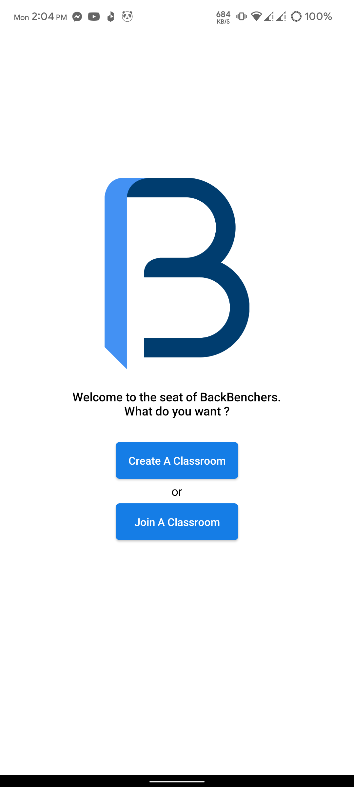
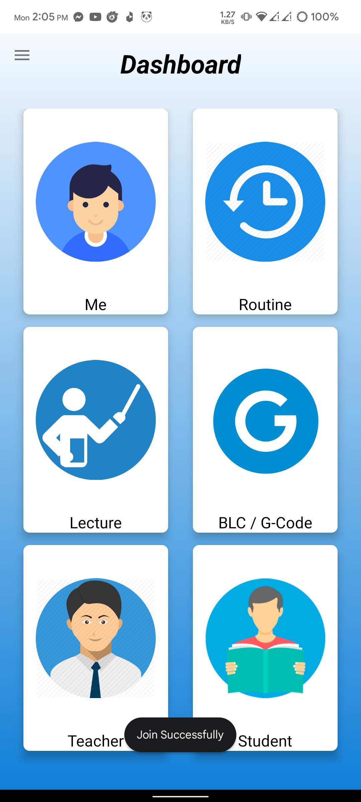
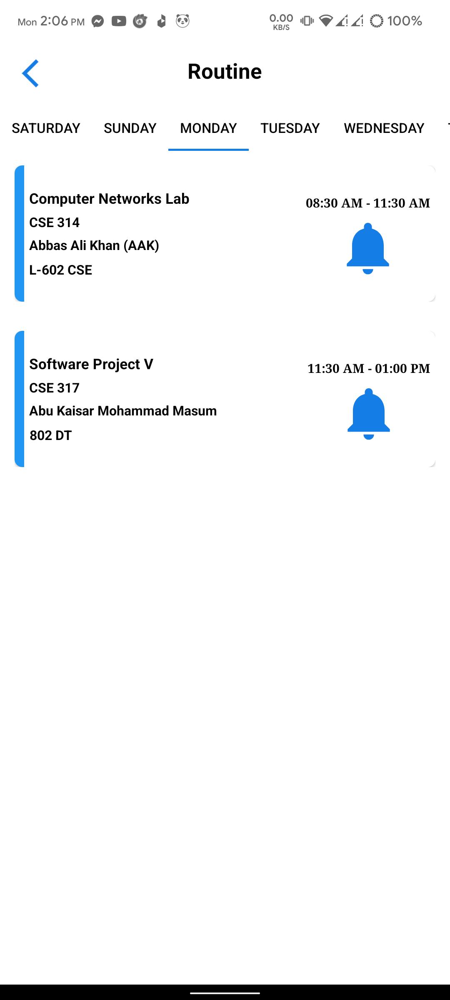
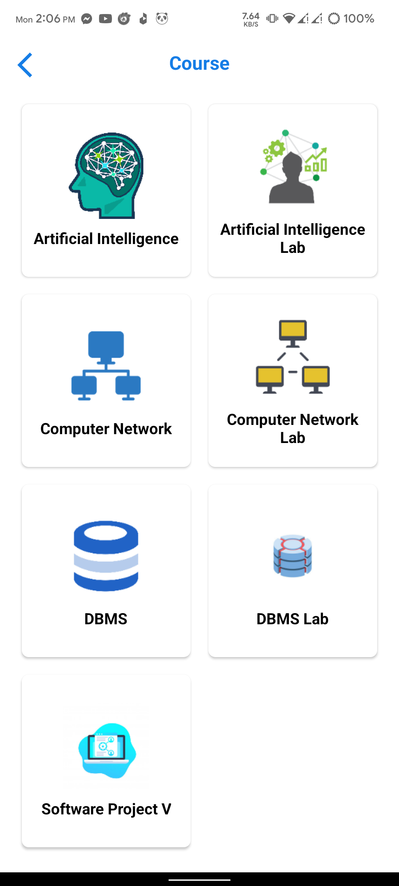
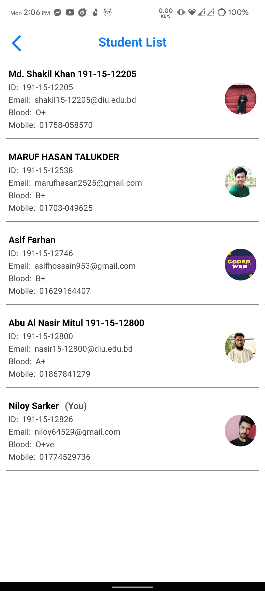
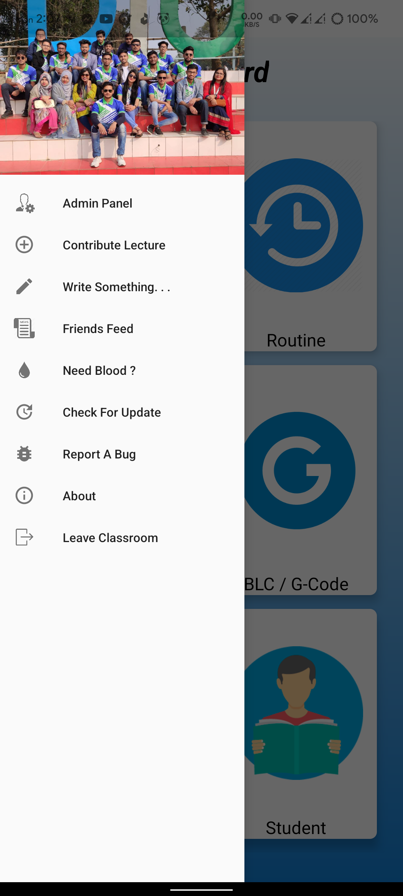
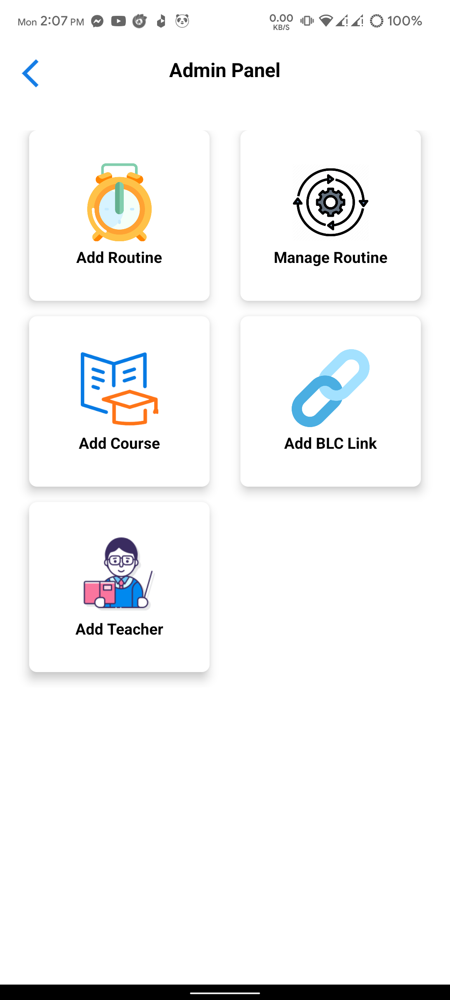
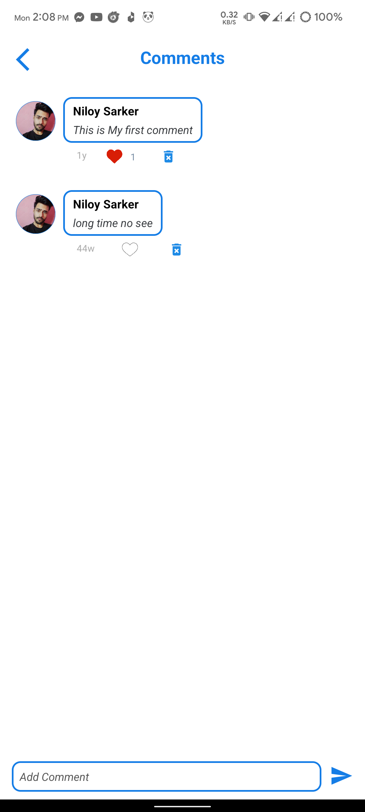
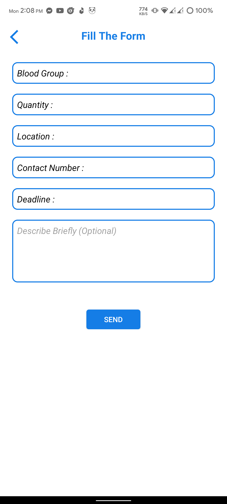

# BackBenchers
Classroom Management System

# Preview Images
1. Splash Screen

2. Getting Start

3. Create a new classroom or Join a existing class

4. Dashboard

5. My Profile

6. Class Routine According to current day of week

7. Course Details

8. External Information or Link 

9. Course Teacher List

4. Enrolled Student List

5. Drawer Panel

6. Admin Panel

7. Friends Feed ( Anyone can post their thought )

8. Comment Section

9. Emergency Blood Need

Follow me for more project. Thank you
